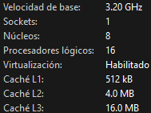

Este repositorio aparte de ser una API que contiene todas las instituciones publicas, es una guia de como podemos optimizar el rendimiento de nuestros aplicativos sin tener que aumentar el hardware.

Al inicio del proyecto este era el response de la API tras las pruebas.

Como podemos ver con una carga 64kb en un json
una concurrencia de #1k Usuarios para 1k solicitudes la API nos respondio con un total de 8s, sin ningun failed, un total transferido de 65015000 bytes.

Los puntos de mejora que se trataron, fueron a las entidades como la #BaseDeDatos, el #Endpoint, el acceder a los #Datos, de manera concurrente.

Primer punto, la base de datos la base de datos fue una simple en SQlite una simple consulta con alrededor de 1k registros, la configuracion que esta tenia, al momento de la primera prueba era esta:

SQlite de por si trabaja de manerea sincronica, no es la mejor opcion para para trabajar de manera asyn.

En este caso accedemos a la base de datos, de manera sync y sin librerias que nos ayuden a manera los loops para las solicitudes async lo cual nos limita la cantidad de sessiones abiertas que podemos tener o consultas concurrentes que podamos hacer.

La session, la estamos manejando totalmente sync, cuando estamos usando un framework y un servidor como lo que es Uvicorn que es totalmente async.

En el archivo main poseemos lo siguiente:

Accedemos a la consulta en el mismo modulo que usamos como entry points, y creamos un generador, en base a una interacion (Si existe una forma de evitar extraer datos sin tener que interar atravez de un bucle es mejor ese camino), declaramos nuevamente la variable que contiene los datos y la retornamos, en este caso, los datos solo se generan cuando se inicia la aplicacion, estos mismos no se actualizaran al menos que se reinicie el servidor, pero como en este caso los datos son estaticos, esta correcto, pero el como accedemos a las variables, sigue siendo de manera sync, y lo que retornamos es un diccionario, que luego fastapi lo interpretara y aa;adira los header cuando este se procese, lo cual se puede mejorar.

#Mejoras
'DB'
Primero comenzamos mejorando los aspectos referente a la primera entidad que es nuestra base de datos

La primera mejora que hicimos fue mediante la lib de msqlalchemy asyncio, permitimos las consultas async hacia la base de datos.

La segunda mejora fue aprovechar los PRAGMA que este contiene para mejorar el rendimiento de esta.

La tercera mejora en esta configuracion fue crear una fabrica de sesiones async con SQlalchemy y creamos una funcion async para obtener esta session.

'Obtencion de datos'

La obtencion de datos anteriormente sync, la convertimos a async, aparte de que hicimos el codigo limpio e escalable, obtenemos la session de manera async, lo cual esta ya la hemos definido para que se pueda acceder de manera async y guardar este contenido en cache.

'Endpoint'
La parte final de esta optimizacion es en el endpoint, en el cual los puntos importantes, fueron el llamado de los datos de manera async, haciendo todo el proceso totalmente async, otros puntos importantes fueron lo que se retorno, al especificar que es un JSON, acortamos el proceso y como el contenido es estatico, y es medible agregamos en el header, el contenido la longitud del json, en bytes, lo que tambien facilita el proceso, por ultimo agregamos en el header, un cache control, para manejar el cache por parte del cliente, en este caso no afecta tanto al rendimiento, pero en caso de que este se acceda mediante un navegador, si afectaria.

'Resultado Final'

2ms en el test, con una carga de 1k usuarios concurrentes procesando 479s por segundo.

Cuando anteriormente sin optimizar, tuvimos el primer resultado de 8s para culminar el test, con la misma carga, pero con 121 respuestas por segundo.

Sin tener que agregar sistemas complejos de cache o aumentar vertical o horizontalmente la aplicacion!

Caracteristicas del equipo utilizado

'Usando todo el CPU'

BUILD
docker build -t api-instituciones-fastapi -f deployment/Dockerfile .
docker run -p 8080:8080 api-instituciones-fastapi